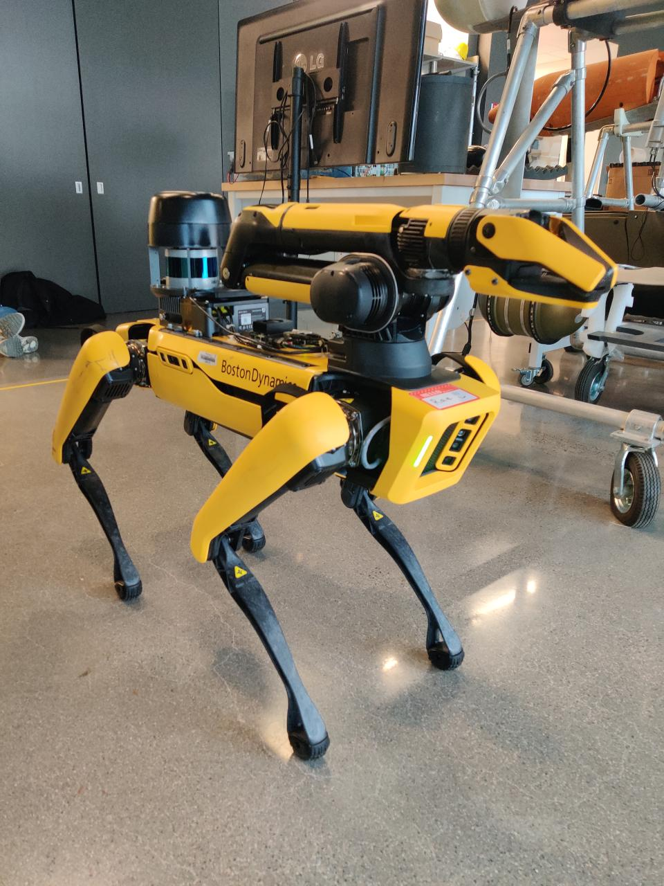

# LIO-SAM with SPOT Robot

  

  **A Journey of Challenges and Progress in Implementing LIO-SAM on Boston Dynamics' Spot**

  
  

## 📋 Table of Contents
- [Overview](#overview)
- [Team Members](#team-members)
- [Motivation](#motivation)
- [What is LIO-SAM](#what-is-lio-sam)
- [Methodology](#methodology)
- [Progress and Achievements](#progress-and-achievements)
- [Challenges Faced](#challenges-faced)
- [Results](#results)
- [Future Work](#future-work)
- [References](#references)
- [Data Access](#data-access)

## 🎯 Overview

This project implements the **LIO-SAM (LiDAR-Inertial Odometry with Smoothing and Mapping)** algorithm on data collected from Boston Dynamics' Spot robot, aiming to achieve high-precision 3D mapping and localization in dynamic, GPS-denied environments.

We implemented the LIO-SAM algorithm on data collected from the Spot robot to create accurate 3D maps of indoor environments. Although the project encountered several challenges, we made substantial progress in understanding the algorithm, collecting high-quality datasets, and resolving technical issues.

  

## 👥 Team Members

**Group 7:**
- Dhyey Mistry
- Yash Wakde
- Adithya Rajendran
- Kevin Jason

**Course:** EECE5554 - Robotics Sensing and Navigation
**Institution:** Northeastern University
**GitLab Username:** mistry.dhy

## 💡 Motivation

Boston Dynamics' Spot robot is transforming how organizations monitor and operate their sites, ensuring team safety and enabling data-driven decisions. Key applications include:

- **Industrial Inspection:** Manufacturing facilities, oil & gas installations
- **Construction Monitoring:** Site surveillance and progress tracking
- **Disaster Response:** Search and rescue operations in hazardous environments
- **Autonomous Navigation:** GPS-denied areas like tunnels and underground facilities

By integrating Spot with advanced SLAM algorithms like LIO-SAM, we can extend its capabilities for precise localization and mapping in challenging environments where GPS is unavailable or unreliable.

## 🔬 What is LIO-SAM?

**LIO-SAM (LiDAR-Inertial Odometry with Smoothing and Mapping)** is a state-of-the-art SLAM algorithm that combines data from LiDAR and IMU sensors to achieve accurate and robust 3D mapping and localization.

### Key Features:

1. **Tight Integration of LiDAR and IMU**
   - Uses LiDAR for spatial accuracy
   - IMU provides motion compensation
   - Enables precise localization in GPS-denied environments

2. **Factor Graph Optimization**
   - Builds a factor graph to optimize poses and trajectories
   - Ensures global consistency
   - Minimizes drift over time

3. **Real-Time Performance**
   - Capable of real-time odometry and mapping
   - Suitable for mobile robotics applications

4. **Loop Closure Detection**
   - Detects when the robot revisits an area
   - Corrects drift and improves map consistency

### Why LIO-SAM?

| Feature | LOAM | LIOM | **LIO-SAM** |
|---------|------|------|-------------|
| **Sensor Fusion** | Relies mostly on LiDAR | Loosely integrates LiDAR with IMU | **Tightly integrates LiDAR and IMU** |
| **Optimization** | No global smoothing (ICP-like) | Loosely optimized over poses | **Factor graph-based global smoothing** |
| **Real-time Capability** | Efficient for real-time | Moderate performance | **High real-time performance** |
| **Accuracy** | Good in LiDAR-dominant environments | Better than LOAM due to IMU | **Best, especially in dynamic motion** |
| **Robustness** | Moderate | Better than LOAM | **High robustness in fast/dynamic motions** |
| **Loop Closure** | Limited | Improved | **Strong with backend optimization** |
| **Implementation** | Computationally efficient but lacks smoothing | Computationally heavier | **Balance of efficiency and accuracy** |

## 🛠️ Methodology

### Algorithm Overview

The LIO-SAM algorithm operates through a systematic pipeline:

#### Input Sensors:
- **IMU:** Captures motion data (orientation, acceleration)
- **LiDAR:** Generates 3D point clouds of the environment
- **GPS (Optional):** Provides additional global positioning constraints

#### Data Processing:
1. **IMU Pre-integration:** Estimates motion trajectories between successive scans
2. **LiDAR Feature Extraction:** Identifies edge and planar features for localization
3. **Factor Graph Construction:** Combines constraints from IMU, LiDAR, GPS, and loop closure

#### Output:
- Produces a globally consistent 3D map
- Accurate pose estimates in real-time

### Hardware Setup

#### Configuration 1: Spot with Onboard Velodyne LiDAR
- Boston Dynamics Spot robot
- Velodyne VLP-16 Puck LiDAR
- Spot's internal IMU

#### Configuration 2: Custom Rig (Final Setup)
- Boston Dynamics Spot robot
- Jetson Nano compute module
- LiDAR sensor
- VectorNav IMU
- Multiple cameras

## 📈 Progress and Achievements

### 1. Research Phase
✅ Reviewed the foundational paper: "LIO-SAM: Tightly-Coupled Lidar Inertial Odometry via Smoothing and Mapping"
✅ Analyzed existing implementations and GitHub repositories
✅ Understood factor graph optimization and sensor fusion principles

### 2. Implementation Phase
✅ Successfully implemented LIO-SAM on KITTI dataset (MIT campus)
✅ Applied loop closure detection - achieved improved map consistency
✅ Generated high-quality point cloud visualizations in RViz

### 3. Data Collection
✅ Collected trial dataset in High Bay environment
✅ Obtained clean point cloud data with excellent detail
✅ Deployed custom rig with external sensors on Spot
✅ Successfully recorded data around EXP building with loop closures

### 4. System Integration
✅ Integrated custom rig with Jetson Nano, LiDAR, and VectorNav IMU
✅ Established ROS2 compatibility
✅ Resolved timestamp synchronization issues
✅ Learned to work with both ROS1 and ROS2 environments

### 5. Technical Problem Solving
✅ Discovered ROS2 support for LIO-SAM (Ubuntu 22.04, ROS2 Humble)
✅ Learned to work with .mcap bag files directly
✅ Modified algorithm parameters for custom sensor configurations
✅ Enhanced understanding of transform frames (TF) and their relationships

## 🚧 Challenges Faced

### 1. Data Compatibility Issues

**Problem:** Spot's IMU messages lacked required ring and intensity data
- Even though rings were visible in RViz, the data format wasn't compatible with LIO-SAM
- Custom driver had timestamp synchronization issues

**Attempted Solutions:**
- Tried extracting IMU data from Spot's SDK
- Attempted using quaternion values from odometry messages
- Created custom scripts to convert data formats

### 2. Sensor Compatibility

**Problem:** LIO-SAM was designed for Microstrain IMUs, but we used VectorNav IMU
- The package couldn't properly receive VectorNav IMU data
- Encountered "Waiting for IMU data..." errors repeatedly

**Solution:**
- Deployed external VectorNav IMU on custom rig
- Modified algorithm parameters in configuration files

### 3. Transform Frame (TF) Errors

**Problem:** World and device TF created a loop instead of proper hierarchy
- Caused "No transform from [world] to [map]" errors
- Prevented proper pose estimation

**Current Status:** Ongoing debugging and investigation

### 4. ROS Version Compatibility

**Problem:** Initially thought LIO-SAM only supported ROS1
- Attempted to convert ROS2 bags (.mcap) to ROS1 bags (.db3)
- Conversion process was complex and time-consuming

**Solution:**
- Discovered ROS2 Humble support for LIO-SAM
- Learned to work directly with .mcap files

### 5. Missing Data Fields

**Problem:** Point cloud data missing ring and intensity values required by LIO-SAM
- Tried adding dummy values - didn't work
- Multiple compatibility errors across different devices

## 📊 Results

### Achievements

1. **Algorithm Validation**
   - Successfully demonstrated LIO-SAM functionality on KITTI dataset
   - Achieved real-time loop closure and mapping
   - Generated high-quality point clouds and consistent maps

2. **Data Collection Success**
   - Captured detailed maps of High Bay environment
   - Recorded comprehensive dataset around EXP building
   - Produced high-quality visualizations in RViz
   - Learned Spot operation, sensor integration, and data processing

3. **Hardware Integration**
   - Tested both Spot GXP (General Expansion Payload) and external rig
   - Successfully deployed Jetson Nano + LiDAR + VectorNav IMU system
   - Established robust data acquisition pipeline

### Lessons Learned

1. **Algorithmic Understanding**
   - Enhanced knowledge of factor graph optimization
   - Deepened understanding of sensor fusion techniques
   - Developed skills to adapt algorithms for diverse hardware

2. **Team Collaboration**
   - Fostered problem-solving through iterative debugging
   - Collaboration within team and across other project teams
   - Effective time management and task distribution

3. **Technical Skills**
   - ROS1 and ROS2 environment setup and troubleshooting
   - Docker and virtual environment management
   - Transform frame debugging and visualization
   - Data format conversion and manipulation

### Limitations

1. **Hardware Constraints**
   - Dependency on specific IMU sensors limited flexibility
   - Sensor compatibility issues with original Spot configuration

2. **Software Issues**
   - Transform frame errors hindered progress
   - Data integration challenges in certain environments
   - IMU data not being received properly by LIO-SAM package

## 🔮 Future Work

We would like to continue working on this project and address the following:

### 1. Immediate Goals
- [ ] Resolve IMU data reception issues with VectorNav
- [ ] Fix transform frame loops and hierarchy errors
- [ ] Successfully implement LIO-SAM on recorded EXP building data
- [ ] Achieve loop closure on real Spot data

### 2. Advanced Testing
- [ ] Evaluate LIO-SAM in multi-floor environments
- [ ] Test in NEU tunnel system (original plan)
- [ ] Assess scalability in larger environments
- [ ] Compare results with other SLAM algorithms (LOAM, LIOM, RTAB-Map)

### 3. Algorithm Improvements
- [ ] Make LIO-SAM more sensor-agnostic
- [ ] Support diverse IMU and LiDAR configurations
- [ ] Optimize for real-time performance on edge devices
- [ ] Enhance robustness in highly dynamic environments

### 4. Applications
- [ ] Autonomous navigation in GPS-denied areas
- [ ] Multi-robot SLAM and mapping
- [ ] Integration with path planning algorithms
- [ ] Real-time obstacle detection and avoidance

## 📚 References

1. T. Shan, B. Englot, D. Meyers, W. Wang, C. Ratti, and D. Rus, **"LIO-SAM: Tightly-coupled Lidar Inertial Odometry via Smoothing and Mapping"**, 2020 IEEE/RSJ International Conference on Intelligent Robots and Systems (IROS), Las Vegas, NV, USA, 2020.

2. LIO-SAM GitHub Repository: [https://github.com/TixiaoShan/LIO-SAM](https://github.com/TixiaoShan/LIO-SAM)

3. LIO-SAM ROS2 Support: [https://github.com/TixiaoShan/LIO-SAM/tree/ros2](https://github.com/TixiaoShan/LIO-SAM/tree/ros2)

4. Research Paper: [https://ras.papercept.net/images/temp/IROS/files/0063.pdf](https://ras.papercept.net/images/temp/IROS/files/0063.pdf)

5. Boston Dynamics Developer Documentation: [https://dev.bostondynamics.com/docs/python/quickstart](https://dev.bostondynamics.com/docs/python/quickstart)

6. Spot ROS2 Integration: [https://github.com/bdaiinstitute/spot_ros2](https://github.com/bdaiinstitute/spot_ros2)

## 💾 Data Access

### Presentation (PPT)
**Full Presentation:** [LIO-SAM with SPOT - PowerPoint](https://northeastern-my.sharepoint.com/:p:/g/personal/mistry_dhy_northeastern_edu/EWOt-jFAwlRNnCoX54vHUCwBgusaLZUnXgaC2cuAEHUhbQ?e=bHdri1)

### ROS Bag Files (Private Access)
**ROS Bag Data:** [Spot ROS Bags - Google Drive](https://drive.google.com/drive/folders/1RfDmF5F1NT71CK6vqHoIkAE6ASSyUo5E?usp=sharing)

Contains:
- Raw sensor data (.bag, .mcap files)
- High Bay recordings
- EXP building loop data
- IMU and LiDAR data streams

### Google Drive - General Data
**All Project Data:** [Group 7 Spot Data - Google Drive](https://drive.google.com/drive/folders/1ofWXLbhqu4m_-7foQu_30O7dn41ErS4w?usp=sharing)

Contents include:
- High Bay trial data
- EXP building loop recordings
- Point cloud visualizations
- RViz screenshots
- Video demonstrations
- Research papers and documentation

### GitLab
Modified algorithm files and configuration scripts:
- **GitLab Username:** mistry.dhy

## 🎓 Acknowledgments

We would like to express our gratitude to:

- **Professor Hanumant Singh** - For providing this incredible opportunity to work with Spot and guiding us throughout the project
- **Jasen Mackie** (TA) - For continuous support and technical assistance
- **Vishnu** (TA) - For always being available and helpful
- **Northeastern University Robotics Lab** - For providing access to Spot and equipment
- **Other Project Teams** - For collaboration and knowledge sharing

## 📝 Conclusion

This project has been an incredible learning journey. Despite not achieving our initial goal of full LIO-SAM implementation on Spot data due to IMU compatibility issues, we:

- Gained deep understanding of SLAM algorithms and factor graph optimization
- Successfully validated LIO-SAM on standard datasets
- Collected high-quality datasets with multiple sensor configurations
- Developed problem-solving skills through debugging complex issues
- Learned to work with advanced robotics platforms like Spot
- Enhanced our knowledge of ROS, sensor fusion, and data processing

**"There are many things that we didn't explicitly explain... Because of the time constraints and also including that would make this more like a manual and less like a report. We think that facing all those challenges has taught us a lot, it is good that we had problems because, without challenges and errors, there is no learning."**

---

  **Northeastern University**
  EECE5554 - Robotics Sensing and Navigation
  Fall 2024

  Made with 🤖 by Group 7

